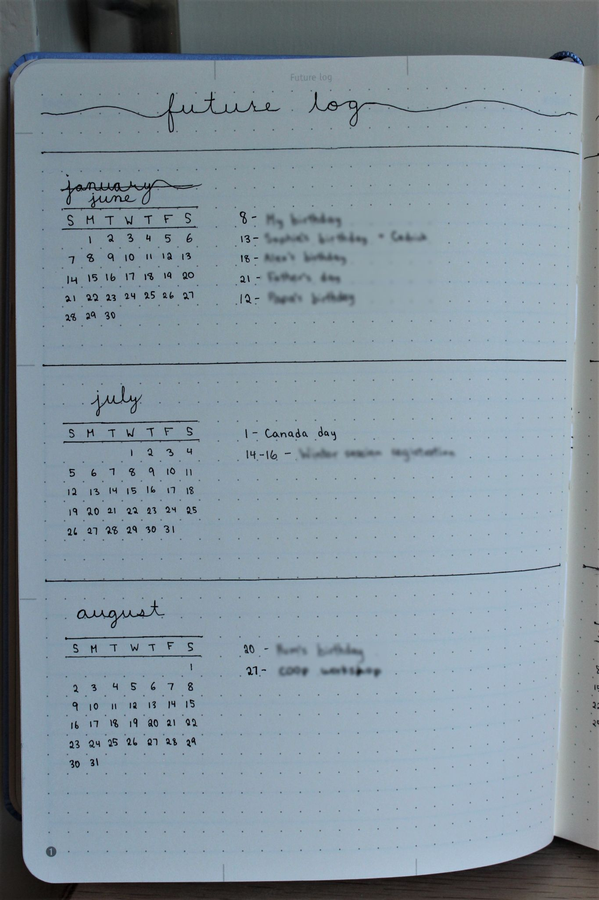
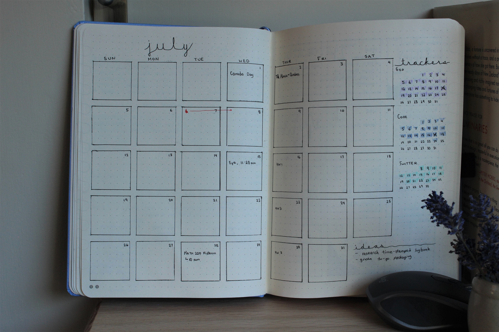
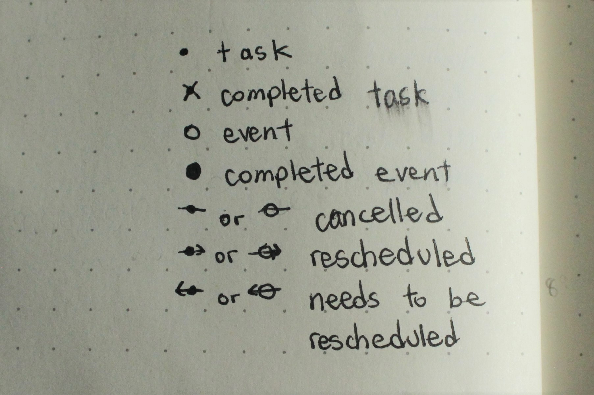
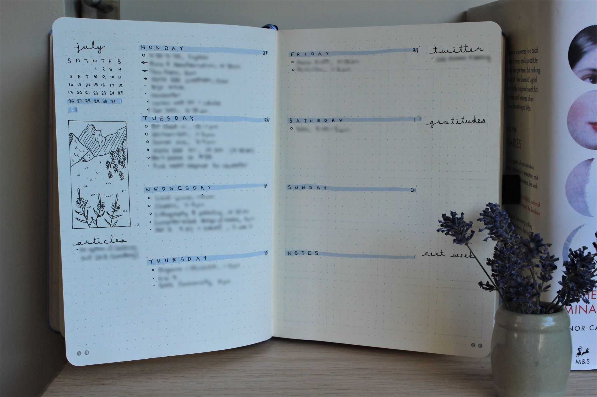
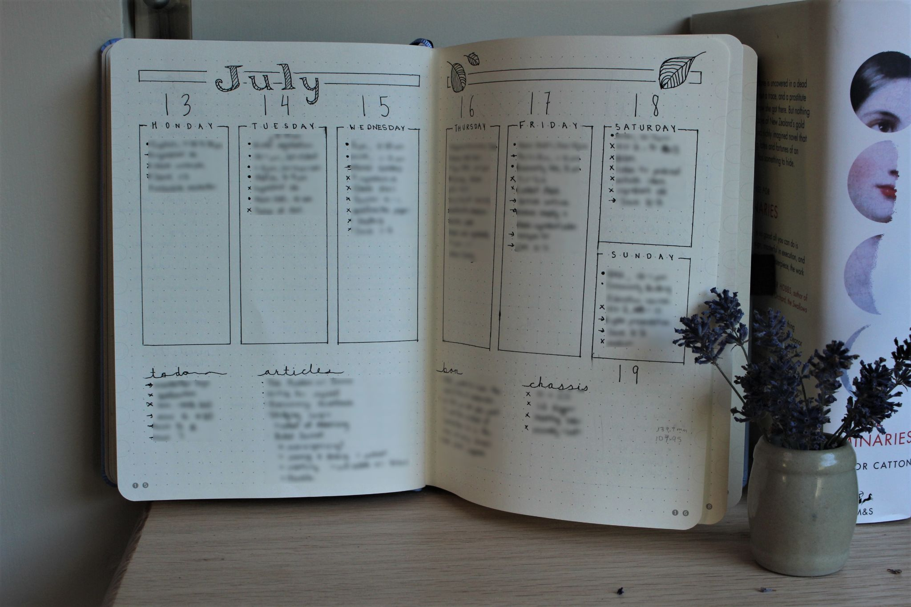
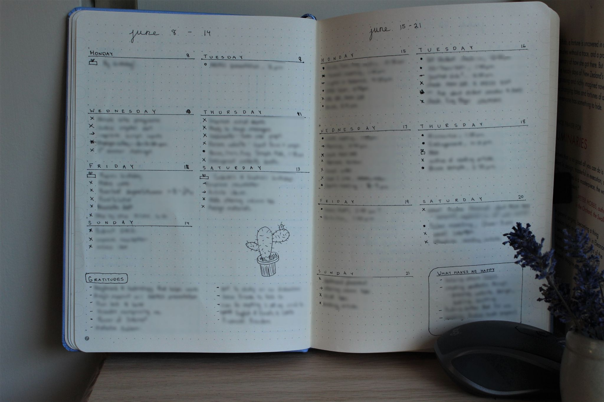
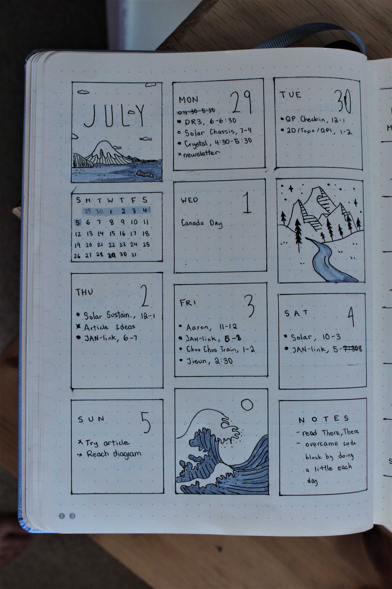

After getting a bullet journal as a birthday present a few months ago, I dove headfirst into the system. And I love it. By planning out my days with a simple pen and paper, I have become more productive and less stressed.

To help others decide whether they should try bullet journaling, I thought I'd write about why I love it and how I use it, with some caveats at the end.

## The Basics of Bullet Journaling
Bullet journaling, reduced to its simplest form, is merely a pen, paper, and a legend. It was created by Ryder Carroll, who describes it as a tool to "help you track the past, organize the present, and plan for the future."

The system is based on planning your days by writing a list of tasks that can be marked as done or rescheduled. For long-term planning, yearly and weekly overviews can be created and easily referenced when writing down daily tasks and events. 

## Why I Love It
Bullet journaling has three main advantages that distinguish it from Google Calendar, Todoist, and similar digital tools. It keeps a permanent trace of events, is tangible, and offers amazing flexibility.

### Permanence
By default, bullet journaling is a permanent way to keep track of life. As it is paper and pen based, everything written down leaves a trace. If you want to reschedule or delete a task or event, you can annotate it with an arrow or cross it out. There is no erasing. Although this might seem scary at first, it is incredibly helpful as it helps with reflection and weekly reviews.

Weekly reviews, which is part of the Getting Things Done methodology by productivity consultant David Allen, helps you tie up loose ends, schedule important tasks that came up during the week, and be mindful of the progress you made.

### Tangible
With the arrival of the Digital Revolution, I think the value of tangibility and analog systems is becoming underrated. Digital tools have amazing features, but it can quickly become too complex and overwhelming. Being able to flip through actual pages and slowly write down tasks and events has helped me be calm in the midst of a chaotic world. Writing down my tasks, which takes more time than typing them out, makes me give more thought to the importance of each task.  And since paper is not of infinite size, I find it easy to avoid over-scheduling my time and energy. This helps with mindful productivity, [a sustainable way to work and think](https://nesslabs.com/mindful-productivity-2).

An obvious difference between bullet journaling and digital tools is the lack of notifications. However, by writing everything down and having my journal in front of me at all times, I find that I remember tasks effortlessly and don't need to be bombarded with notifications. I am less stressed this way as I don't need to worry about missing a notification since everything is stored in my brain. In a sense, the lack of notifications is a plus.

### Flexible
Since the entire journal is a blank canvas, it is up to the user to create everything. It allows me to be creative and organize my weeks depending on the amount of work I have. I can also add extra features, such as habit trackers, book reviews, and idea spaces. This not only helps with having complete control over planning your days, but also helps with exploring fun creativity.

## How I Use It
I start with a yearly overview, called a "future log", that allows me to note important events, deadlines, and birthdays. For each month of the year, I create a mini monthly calendar on the left, and leave space on the right for writing down those important dates. I then reference the future log when creating my monthly and weekly spreads to make sure I don't miss anything important.

My monthly overviews consist of a large calendar that fills up two pages. The boxes can be filled in with important dates, and the remaining space contains my additional features like trackers and project ideas.

Finally, the most interesting spread: my weekly overviews. I have experimented with a lot of layouts, but the essentials are the same. I write down my tasks and events under the corresponding day, and then annotate them with my legend elements. Mine is currently as follows:
- dot: task
- crossed-out dot: completed task
- circle: event
- filled-out circle: completed event
- line-through: cancelled task or event
- right-arrow: rescheduled task or event
- left-arrow: task or event needs to be rescheduled

I also like writing about nice things that happened during the day and cool thoughts I came up with. Here are some examples of my weekly spreads:

## Some Caveats
### The Shiny New Object Syndrome
Planning your life on paper with a new system will not automatically help you take control of real life. Like most tools, the bullet journaling system is a method to support you in being more productive, but will not do the work for you. You still need to do the tasks you have written down, and be fully present at the events you have scheduled. If your existing method works, then stick with it instead of taking the effort to transition to a new system.

### Dangers of Permanence
Organizing in general can be a great way to plan and be productive. However, with a pen and paper, you can easily run into the soul-sucking problem of over-organizing. With a limited amount of space and no possibility of erasing, it can be easy to fall into the trap of needing to plan every minute detail to fit in nicely within the confines of the page. Since the future is uncertain and nothing ever goes to plan, this is practically impossible. Instead, feel comfortable with getting a bit messy and imperfect. It's all part of the process and gives you a better and accurate view of reality.
Having to leave tasks unchecked and needing to be rescheduled or crossed out can be another problem for those with a perfectionist eye. You may want to leave it as it is, and hope you finish the task miraculously before the end of the day. In the beginning, this might work as your motivation for aesthetics triumphs your low levels of energy and motivation for the task itself. In the long run, however, this is unsustainable and can leave you drained. Just reschedule the task! Being able to see what types of tasks you reschedule and the crossed out scribbles is a good method to assess your workflow.

It's better to view bullet journaling as a guideline to go about your day instead of a strict schedule. My bullet journal is filled with scribbles and random thoughts, which I didn't enjoy in the beginning. Over time, as I realized that aesthetics will not help me with my task, bullet journal has taught me to be okay with imperfection. As long as I'm moving towards my goals, that's perfect enough.

### The Invasion of Aesthetics
Wanting something to look nice can be great, as long as it does not impede on its usefulness. With bullet journaling, a blank page means unlimited creativity and this can turn into a problem. A few weeks ago, I made the following spread:

I had taken inspiration from Pinterest, and I loved how it looked. However, in terms of practicality, it was useless. I could write three events at max, and tasks were just not written down. That meant I had to memorize what to do, so naturally, I forgot to do a few items on my list.

The advice that comes out of this: be as creative as you want until it hinders the use. I like to add a bit of cursive writing, a few drawings, colors, and that's it.  I like to be a bit creative as it helps me associate certain events and text with colors and drawings I made that week. You can also be like my brother and not have any colors or defined layout as long as it works.

## Tl;dr
Bullet journaling is an effective way to increase mindful productivity and reduce stress. By being tangible and simple, a journal keeps a permanent record of tasks allows for the user to express their creativity and adapt the system to their needs.

To avoid becoming hopelessly entangled with digital tools and notifications, try bullet journaling.